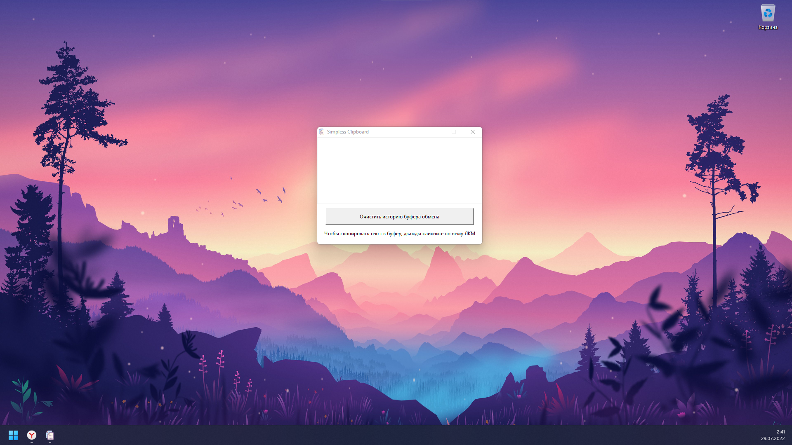
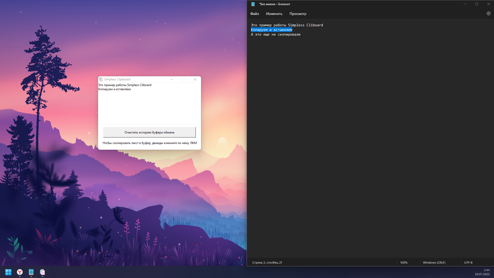
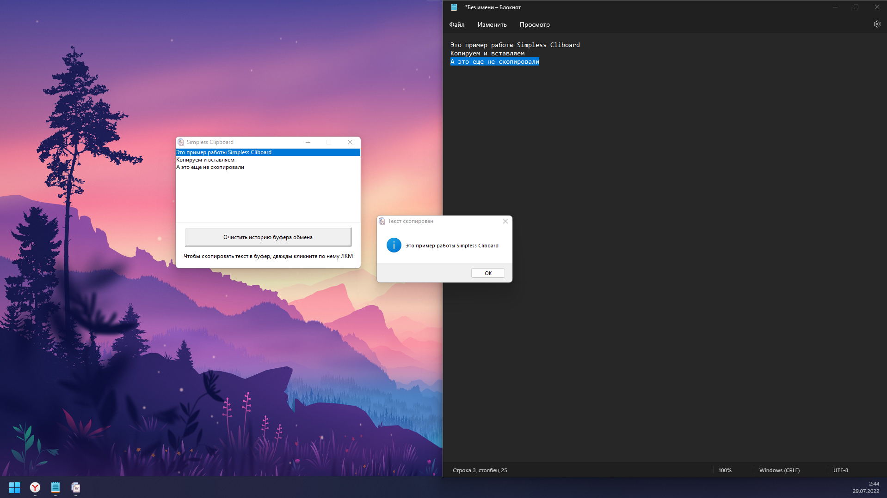

# Simpless Clipboard
Простой и удобный менеджер буфера обмена. Это мой первый проект с использованием библиотек Pyperclip и TKinter, первая проба создания графических интерфейсов для Python.
## Принцип работы
Программа берет содержимое буфера обмена при нажатии клавиш Ctrl + C и сохраняет его в истории. Вставить ранее скопированный элемент можно дважды кликнув ЛКМ по нему.

<code>&gt; Прим.: программа не работает при использовании контекстного меню и функций Копировать или Вставить.
</code>

Основное окно программы при закрытии сворачивается в системный трей и находится там. По нажатию ПКМ на иконку в трее появляется контекстное меню, из которого можно вновь вызвать основное окно, спрятать его или закрыть приложение.

## Инструкция по использованию

1. Скачайте архив с исходным кодом на свой компьютер.
2. Распакуйте скачанный архив в любом удобном месте.
3. Нажмите сочетание клавиш Win + R и в появившееся окно введите shell:startup. Откроется окно с ярлыками для программ, которые будут стартовать вместе с системой.
4. Добавьте в эту папку ярлык на файл main.exe, который находится в папке output.

## Скриншоты






## Связь с разработчиком
По всем вопросам, обращайтесь в [Telegram](https://t.me/bantikgames).